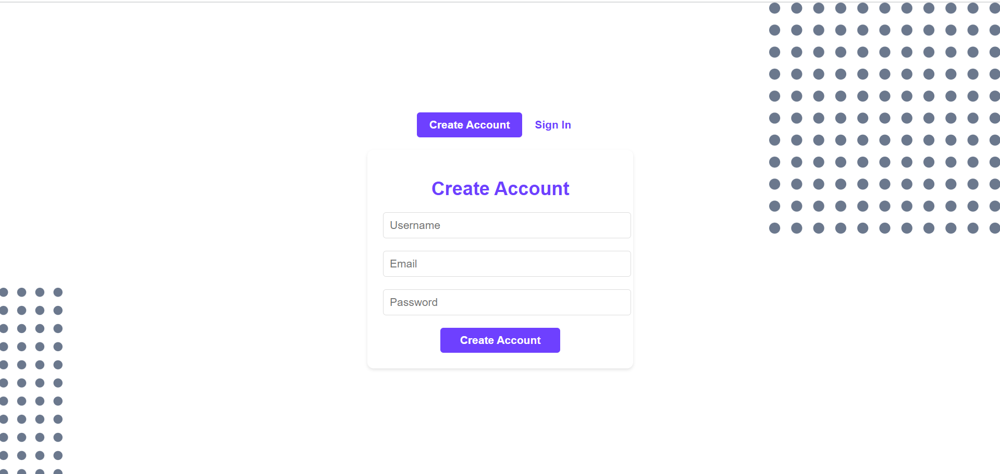
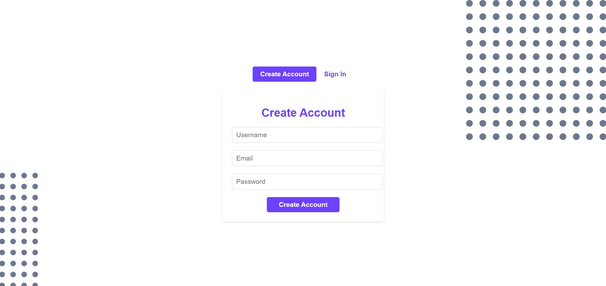
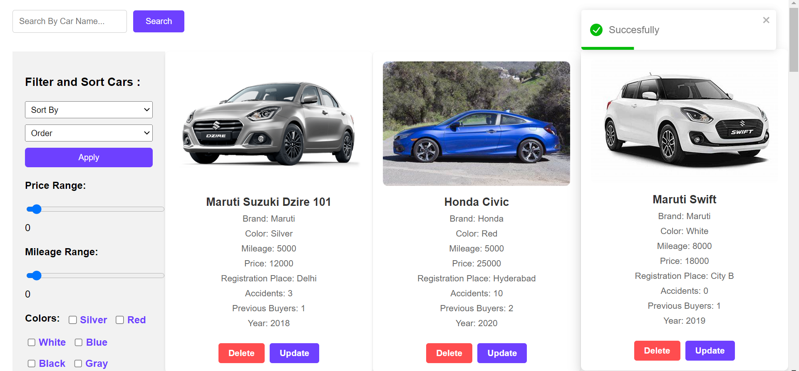
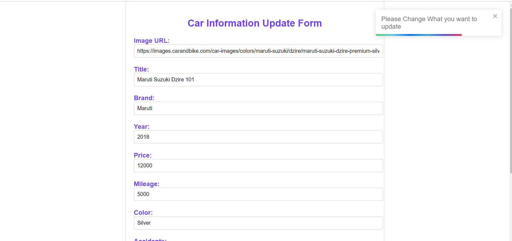
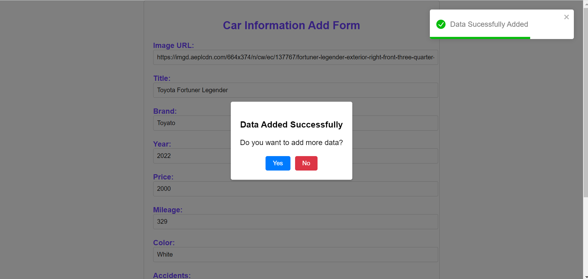
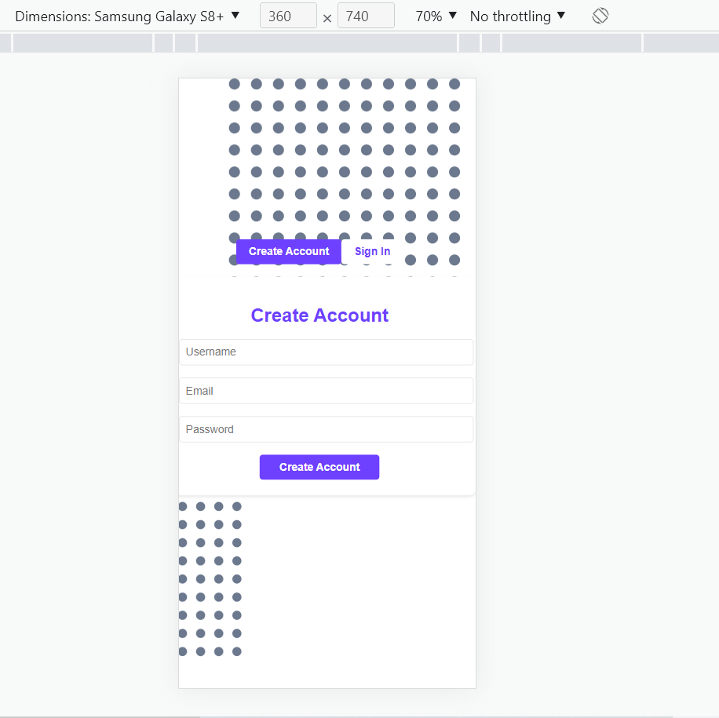

<h1 color="#6E40FF" fontSize="30px"> ATTRYB  </h1>

<h3>Create Account</h3>

<h3>Login</h3>

<h3>Home Page </h3>

<h3>Update Data </h3>

<h3>Add Data</h3>

<h3>Ressponsive </h3>

<!-- <h2 > Deploy </h2>
<a href="https://attryb-alpha.vercel.app" target="blank"> Link</a> -->